# WeAreDevelopers Conference 2024 Talk
Accelerating GenAI Development: Harnessing Astra DB Vector Store and Langflow for LLM-Powered Apps

## Abstract

Join Dieter and Michel in this session as they demonstrate how leveraging Astra DB’s vector store and Langflow can significantly expedite the development of applications powered by LLMs. This session will provide a detailed look into how these technologies streamline the creation and deployment of LLM-driven solutions, significantly speeding up development processes.

The session will start with an introduction to the vector capabilities of Astra DB, which are essential for managing the high-dimensional data demands of generative AI applications. We will then focus on how Langflow, a pioneering low-code platform, accelerates the development lifecycle of LLM-powered applications. By facilitating rapid prototyping and iteration, Langflow enables developers to reduce development time dramatically.

## Content

- [Talk Recording](https://youtu.be/mR-UzyWheX0?t=160)
- [PDF Version of the Talk](./assets/Accelerating%20GenAI%20Development.pdf)
- [Demos](#demos)

## Demos

The theme of the demos is the implementation of a Bicycle Recommendation Service. 
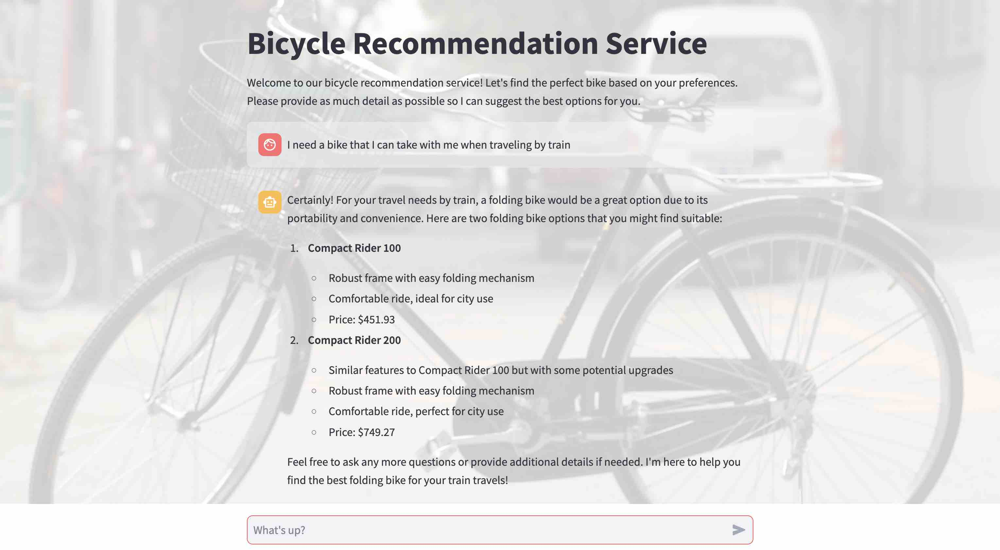
All demos use the same bicycle catalog as context data. The catalog contains 100 bicycles with the following fields: `id`, `bicycle_type`, `product_name`, `product_description`, and `price`. The field `product_description` is the one that will be vectorized to perform a semantic search to find the perfect bike based on user preferences. The demos cover Astra DB, Astra Vectorize, RAGStack, and Langflow. 

### Demo Overview
1. **Without vs. with RAG**: Shows the impact of Retrieval-Augmented Generation (RAG) on the relevance of responses.
2. **Vectorize the Easy Path**: Illustrates the ease of vectorizing data using Astra DB’s Vectorize capability.
3. **Coding Demo with RAGStack**: Demonstrates the implementation of an LLM-powered application with RAGStack.
4. **No-Coding Demo with Langflow**: Highlights the rapid development capabilities of Langflow for LLM-powered applications.

### Setup Instructions
1. Clone the repository:
    ```sh
    git clone https://github.com/difli/WeAreDevelopers2024.git
    cd WeAreDevelopers2024
    ```
2. Create a *Virtual Python Environment*. Use the below to set it up:
    ```
    python3 -m venv myenv
    ```
    Then activate it as follows:
    ```
    source myenv/bin/activate   # on Linux/Mac
    myenv\Scripts\activate.bat  # on Windows
    ```
3. Install the required dependencies:
    ```sh
    pip install -r ./coding/requirements.txt
    ```
3. Make a copy of the [`secrets.toml.example`](./coding/.streamlit/secrets.toml.example) and name the file `secrets.toml`:
    ```sh
    cp ./coding/.streamlit/secrets.toml.example ./coding/.streamlit/secrets.toml
    ```
4. Ensure you have a vector-capable Astra database (get one for free at [astra.datastax.com](https://astra.datastax.com)) on AWS in Region us-east-2. You will need to provide the **API Endpoint**, which can be found in the right pane under *Database details*. Ensure you have an **Application Token** for your database, which can be created in the right pane under *Database details*. Configure your connection details `ASTRA_API_ENDPOINT` and `ASTRA_TOKEN` in the `secrets.toml` file.
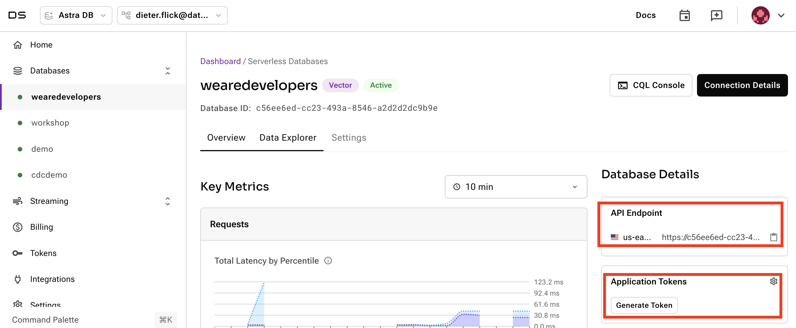
5. Create an [OpenAI account](https://platform.openai.com/signup) or [sign in](https://platform.openai.com/login). Navigate to the [API key page](https://platform.openai.com/account/api-keys) and create a new **Secret Key**, optionally naming the key. Configure your `OPENAI_API_KEY` in the `secrets.toml` file.
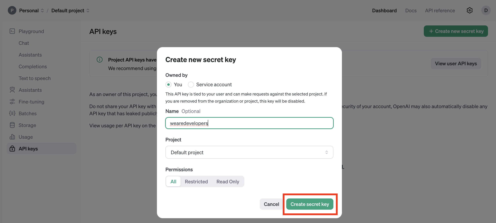
6. Execute the [loader.py](./coding/loader.py) script to create the `bicycle_catalog` collection in your Astra DB database and populate it with the bicycle catalog data. Ensure you do this within the `coding` folder of this repository:
    ```sh
    streamlit run loader.py
    ```

Let's have fun with the demos now!

### 1. Without vs. with RAG
#### Description
This demo shows the impact of Retrieval-Augmented Generation (RAG) on the relevance of responses for LLM-powered applications.

#### Flow of the Demo
1. Run [app_without_rag.py](./coding/app_without_rag.py). Ensure you are within the `coding` folder.
    ```sh
    streamlit run app_without_rag.py
    ```
2. **Without RAG**
    - Uncheck `Enable Retrieval Augmented Generation (RAG)`
    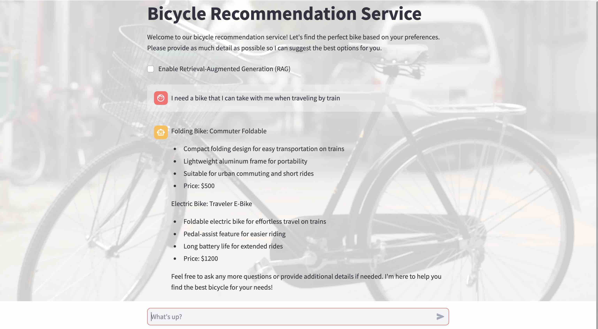
    - The bicycle recommendations are `generic` without RAG. The listed bicycles are not from our bicycle catalog. The LLM was trained on a vast amount of public data, but not with our private data. Therefore, it does not know about our catalog and cannot recommend any of our specific bikes that we have in our store and want to sell.

2. **With RAG**
    - Check `Enable Retrieval Augmented Generation (RAG)`
    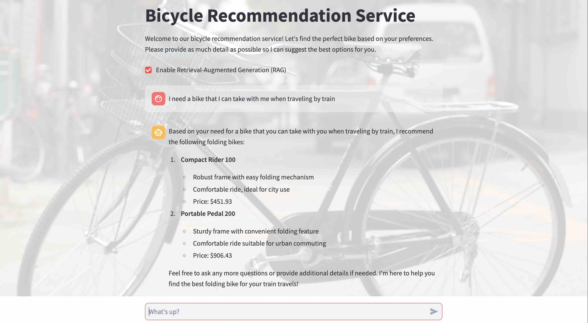
    - The bicycle recommendations are `relevant` with RAG. The listed bicycles are contextually relevant and are from our bicycle catalog. While the LLM is still not trained on our data, a semantic search with Astra DB over our bicycle catalog data retrieves the relevant bikes and provides them as context to the LLM. Now, the LLM can make relevant recommendations based on the bikes we have in our store and want to sell.

### 2. Vectorize the Easy Path
#### Description
This demo illustrates the ease of vectorizing data using [Astra DB Vectorize](https://docs.datastax.com/en/astra-db-serverless/databases/embedding-generation.html).

#### Flow of the Demo
1. Create a vector-enabled collection via the Astra DB UI. Choose NVIDIA as the vector creation method. This service is hosted on the Astra DB platform side by side with your data, ensuring the fastest performance and low cost to vectorize data when it is loaded.
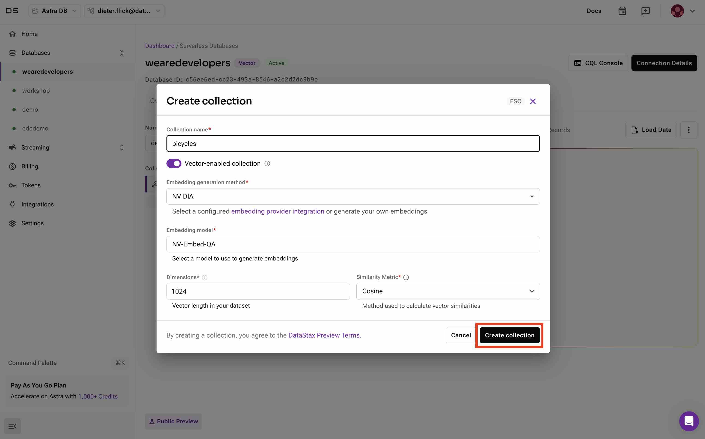
2. Load the bicycle catalog data into your collection. Load [bicycle_catalog_100.json](./vectorize/bicycle_catalog_100.json) and select the field `product_description` as the field to vectorize.
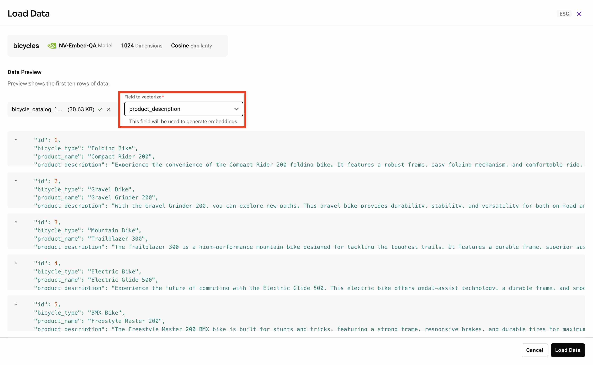
3. Execute a semantic search. Insert `I need a bike that I can take with me when traveling by train` into the vector search field and hit Apply. On top of the collection data, you will see the bicycle from the catalog that is most similar to the vector search text: `Compact Rider 100`. This bike is from our private context, the bicycle catalog, and we will see it over the course of the other demos. This is how we retrieve our context that we later pass to the LLM to get a relevant response.
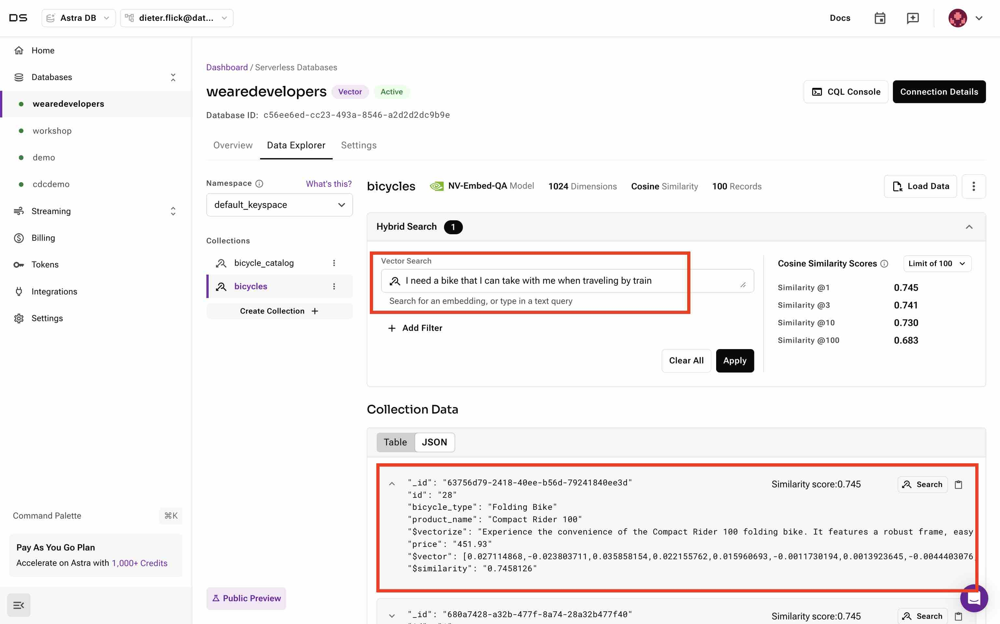

### 3. Coding Demo with RAGStack
#### Description
This coding demo showcases the use of RAGStack for an LLM-powered application. It also contrasts the coding approach with the no-coding approach.

#### Flow of the Demo
1. Open [requirements.txt](./coding/requirements.txt). `ragstack-ai` provides a curated list of dependencies, tested and maintained by DataStax. RAGStack includes all dependencies required to implement any kind of generative AI application with versions that are tested to work well together. This is essential for enterprise applications in production.
2. Open the [app.py](./coding/app.py) file to see the import statements for modules and classes that come with ragstack-ai.
3. Follow the comments and instructions in the script to understand the implementation. There are quite a few of them. The developer needs to be familiar with their usage. 
4. Even this simple application requires a considerable amount of code, which takes time and is error-prone.
5. Run [app.py](./coding/app.py) to see the RAG-based bicycle recommendation service built with RAGStack in action. Insert `I need a bike that I can take with me when traveling by train` into the input field and hit Apply. The recommendation you get is from the bicycle catalog with its description that is most similar to what was entered in the input field. Again, `Compact Rider 100`. This bike is from our private context, the bicycle catalog, and we will see it over the course of the other demos. There is no chance for the LLM to hallucinate as we retrieved the most similar bicycle products based on their descriptions with Astra DB vector search and passed this context to the LLM to generate a response based on this. Ensure you are within the `coding` folder.
    ```sh
    streamlit run app.py
    ```
    

### 4. No-Coding Demo with Langflow
#### Description
This no-coding demo highlights the rapid development capabilities of Langflow for LLM-powered applications.

#### Flow of the Demo
1. In the Astra UI, switch to Langflow.
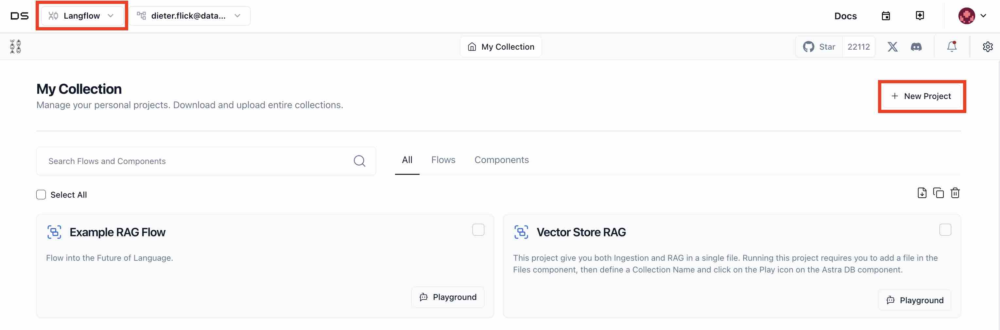
2. Click on `Create New Project`. Select the `Vector Store RAG` template.
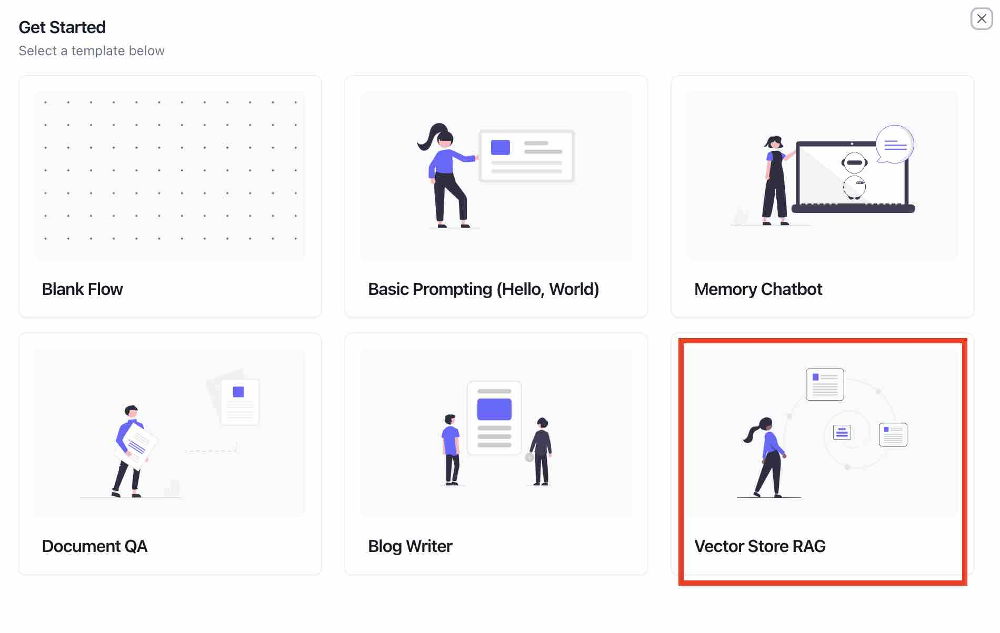
3. All demos use Astra vectorize to generate embeddings. To be consistent, delete the OpenAI Embeddings component.
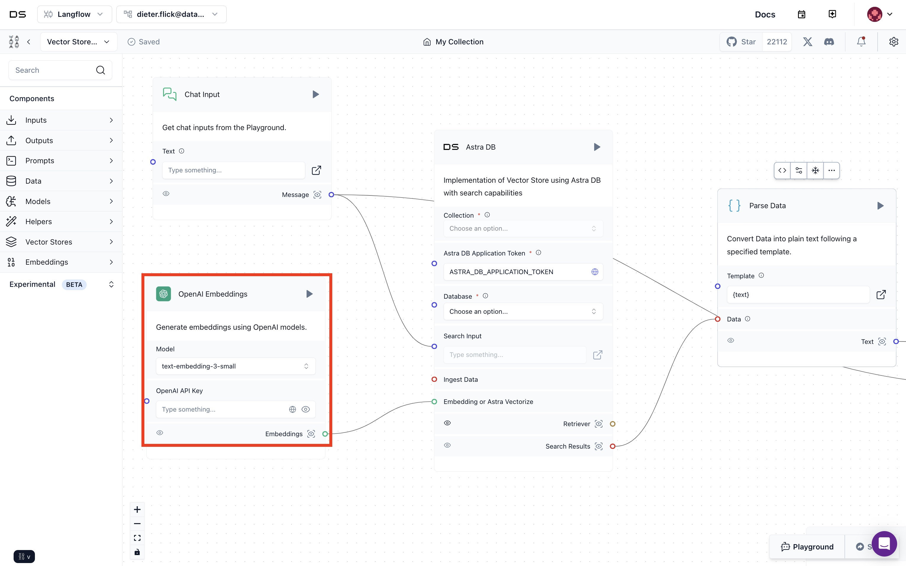
4. Drag and drop the Astra vectorize component under the embeddings menu into the canvas. Choose `NVIDIA` as the provider and insert `NV-Embed-QA` as the model. Connect the Astra Vectorize with the Astra DB component.
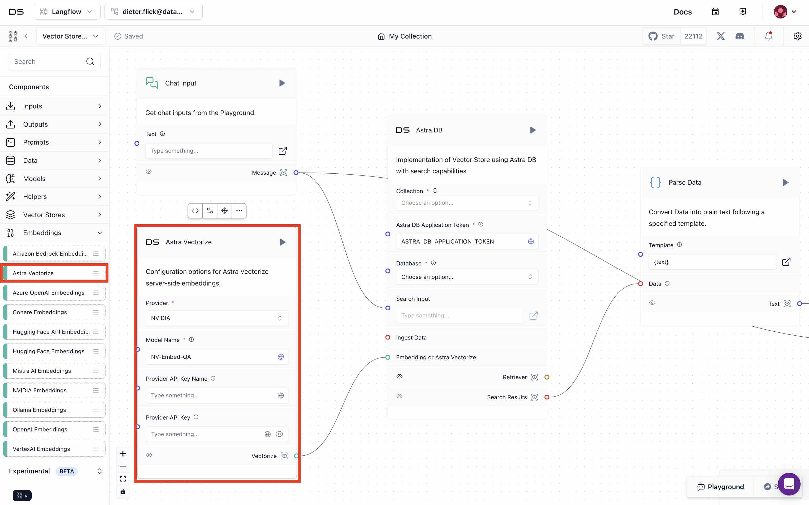
5. Select `wearedevelopers` under Database and `bicycle_catalog` under Collection for the Astra DB component.
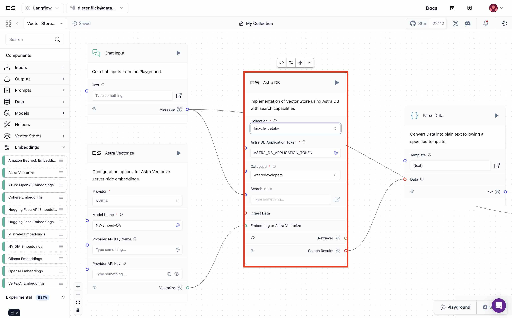
6. Change the template field of the `Parse Data` component to `{data}`. This ensures all data from the retrieved documents from Astra DB goes into the context of the prompt.
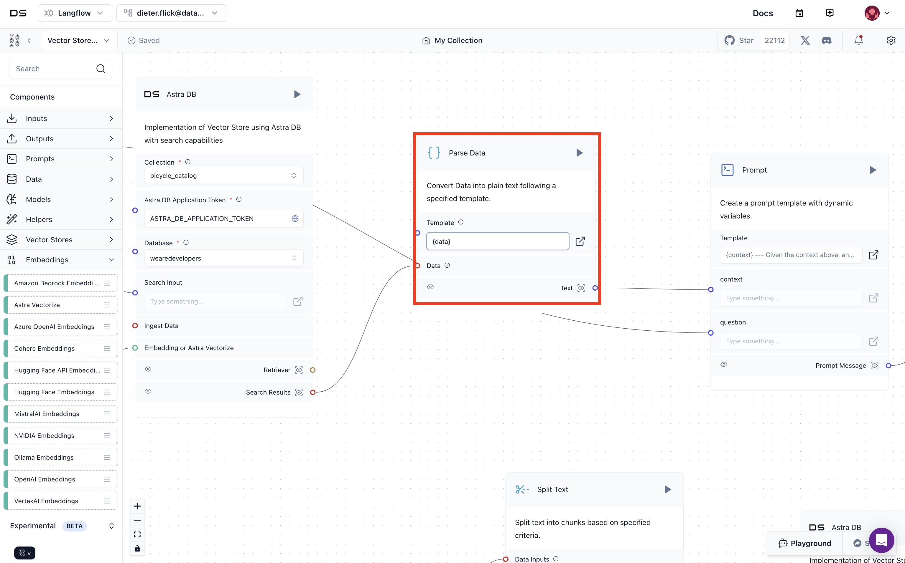
7. Change the prompt template to what is used as the prompt in app.py. The prompt is where the programming of our generative AI application happens in English language.
    ```python
    You’re a helpful AI assistant tasked with helping users find the perfect bicycle based on their preferences and needs. You're friendly and provide extensive answers. Use bullet points to summarize your suggestions. Here's how you can assist:
    
    After gathering the user's preferences, provide at least two bicycle products that match their criteria.
    Use bullet points to summarize each suggestion, including key features, benefits, and price.
    Example:
    "Mountain Bike: Trailblazer 300
    Durable frame with advanced suspension system
    Excellent traction for rugged terrain
    Price: $1500"
    "Road Bike: Speedster 200
    Lightweight aerodynamic design
    High-performance tires for speed
    Price: $800"
    
    Encourage Further Questions and Offer Additional Assistance:
    
    "Feel free to ask any more questions or provide additional details if needed. I'm here to help you find the best bicycle for your needs!"
    
    CONTEXT:
    {context}
    
    QUESTION:
    {question}
    
    YOUR ANSWER:
    ```
8. Provide an `OpenAI API Key` for the OpenAI component.
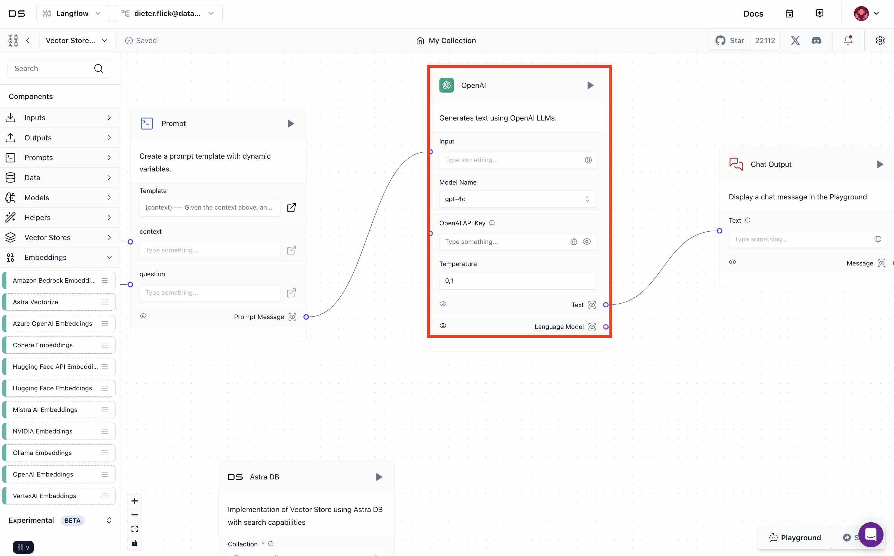
9. Execute the flow by clicking `Playground`.
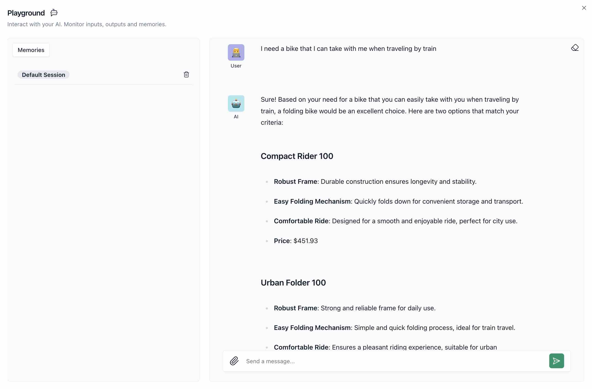
10. A flow can be integrated into an application. Let's do that. First, [install and run Langflow](https://github.com/langflow-ai/langflow?tab=readme-ov-file#-get-started) locally. Import the flow [WeAreDevelopers.json](./no-coding/WeAreDevelopers.json) in your local Langflow instance. Ensure all credentials and fields are populated as above. Click the `API` button. Copy the URL from the `RUN cURL` tab.
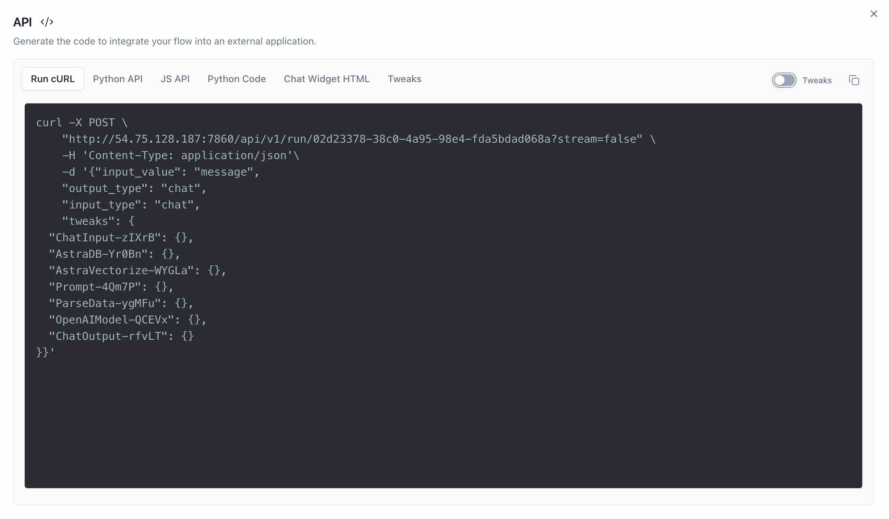
11. Paste the URL you copied into [app_langflow.py](./coding/app_langflow.py). There is no generative AI-related code (e.g., no Langchain modules and classes) in the code. The code is just about the UI and the integration with Langflow where the generative AI flow will be executed.
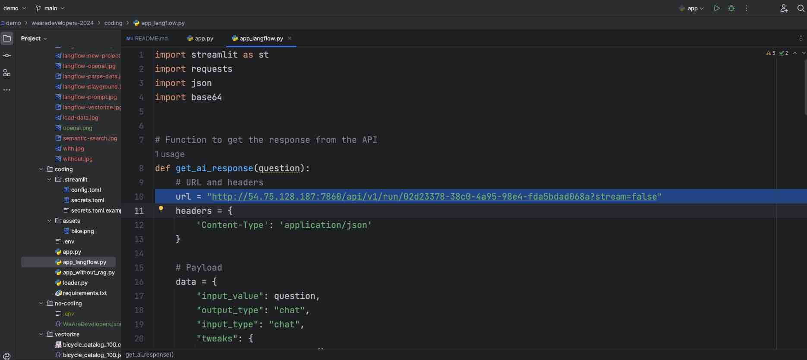
12. Execute your adapted [app_langflow.py](./coding/app_langflow.py) application. Ensure you are within the `coding` folder.
    ```sh
    streamlit run app_langflow.py
    ```
13. This time we get a Langflow-powered bicycle recommendation service but still the same recommendation based on our bicycle catalog.
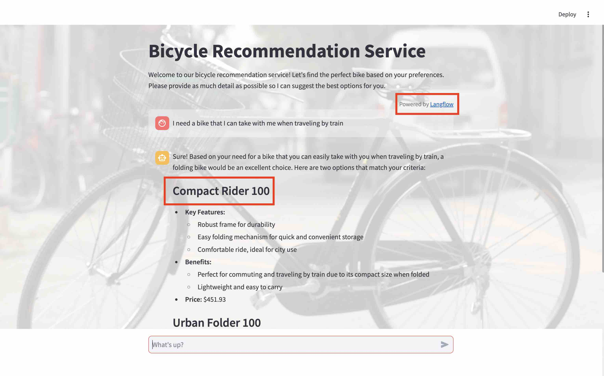

## Resources
- [Astra DB Documentation](https://docs.astradb.com)
- [Astra Vectorize](https://docs.datastax.com/en/astra-db-serverless/databases/embedding-generation.html)
- [RAGStack](https://docs.datastax.com/en/ragstack/index.html)
- [Langflow Documentation](https://docs.datastax.com/en/ragstack/langflow/index.html)
- [WeAreDevelopers Conference](https://www.wearedevelopers.com/)

## Contributing
Contributions are welcome! Please read the [CONTRIBUTING.md](CONTRIBUTING.md) file for guidelines.

## License
This project is licensed under the MIT License - see the [LICENSE](LICENSE) file for details.
